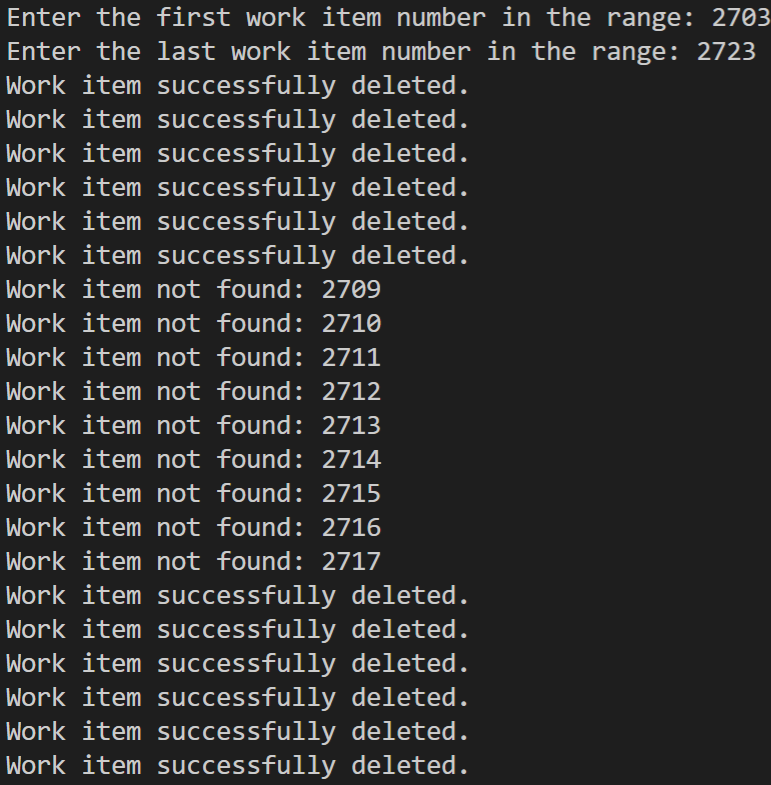

# Work Item Delete 
This is a simple console application which can be used to *destroy* a range of work items from Azure DevOps Services/Server 2019.  The application accepts a starting and ending work item ID number, and destroys all work items in that range.  **Use with caution:** *The destroy operation is irreversible*.  Once deleted, the work items may not be restored.

## Getting Started
In the Program.cs file, update the URL, PAT, and projectName fields with the necessary information.
Run the application.  You will be prompted for the first work item number and last work item number in the range to be destroyed.  Once entered, the application will destroy each work item in that range.

## Results
For each deleted work item, a success message is written to the console.  If a work item is not found, a message stating that the work item is not found and the work item ID is written to the console.

